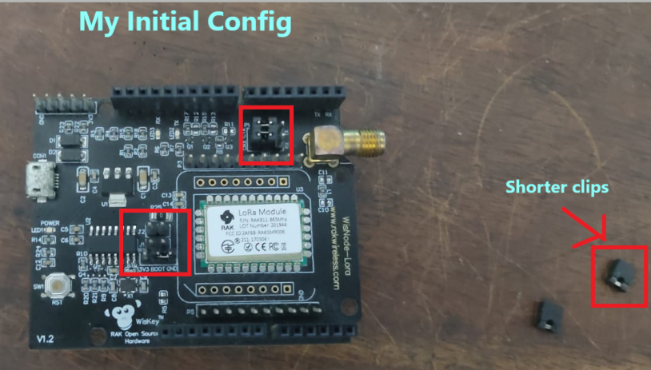

# LoRa Node to Gateway Config and setup

This is a README file for how I managed to connect my RAK811 LoRa Node to a Things Network Gateway near me and send Hexadecimal values from Node to the Things Network platform.

Later on, I also managed to attach my RAK811 LoRaNode with an Arduino UNO as a shield and send data to the Things Network via the Arduino UNO.

## Prerequisites:

1. RAK811 LoRa Node
   - NOTE: If you are planning on buying a RAK811 LoRa Node, do check up the frequency band which is free/available in your country. For LoRa nodes, several frequency band exists like EU868, IN865 etc.
2. Arduino UNO (if you want to use the RAK811 LoRa Node as a shield ontop an Arduino UNO)
3. Appropriate antenna in the correct frequency range for transmitting the LoRa Node data.
4. Sensors like DHT or something to connect to Arduino UNO whose data you want to transmit via LoRa
5. USB Cable, jumper wires etc

## Software Prerequisites

You are going to need the following softwares

1. [STM32CubeProgrammer Tool](https://www.st.com/en/development-tools/stm32cubeprog.html)
2. [RAK Serial Port Tool](https://downloads.rakwireless.com/en/LoRa/RAK811/Tools/RAK_SERIAL_PORT_TOOL_V1.2.1.zip)
3. [RAKLoRaButton Upgrade Tool](https://downloads.rakwireless.com/LoRa/RAK612-LoRaButton/Tools/RAK%20LoRaButton%20Upgrade%20Tool%20V1.0.zip)

## Step 1: Setting up the LoRa Node.

Depending on the date of purchase, your RAK811 LoRa Node can be having latest firmware flashed onto it or not. Anyways, I am going to be burning my RAK811 LoRa Node with its bootloader and firmware.

Before beginning, you should have the following files:

- [RAK811_BOOTLOADER](https://downloads.rakwireless.com/LoRa/RAK811/Bootloader/RAK811_BOOT_V3.0.2.zip)
- [RAK811_FIRMWARE](https://downloads.rakwireless.com/LoRa/RAK811/Firmware/History-Release-Version/RUI_RAK811_V3.0.0.12.H.T%28EU868-US915-AU915-KR920-IN865%29.rar)

#### NOTE1: RAK811 Firmware can be for several regions, the ones ending with "H" are for the following frequency bands EU868-US915-AU915-KR920-IN865. If you are not from regions operating under the above frequency band, get the firmware with the "L" version

#### NOTE2: The RAK811 Downloads folder does contain a Latest Firmware file which apparently doesnt work at least in my RAK811 LoRa Node. So i will be using the History Release version, "RUI_RAK811_V3.0.0.12.H.T"

Now we are all set to start configuring our LoRa Node

### HARDWARE CONFIG

1. The RAK811 LoRa Node you have will be looking like this if bought as a shield.Depending on how it was configured before you get it, it may have one or more shorter clips attached to its several points. For flashing the firware, you need to configure these pins in a certain mode.

This is how it looks before config for me below

This is the boot config below

Now,

1. Open STM32CubeProgrammer after installation and connect the LoRaNode with usb to ur laptop/desktop set the following as shown in the figure:
   
